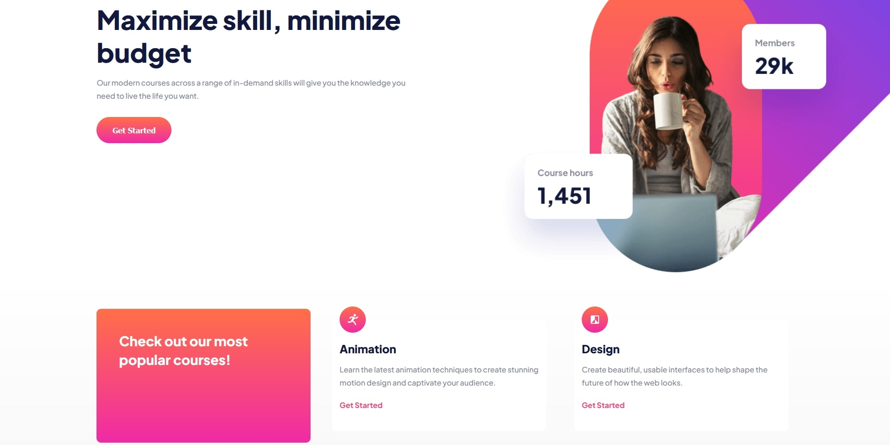

# Frontend Mentor - Skilled e-learning landing page solution

This is a solution to the [Skilled e-learning landing page challenge on Frontend Mentor](https://www.frontendmentor.io/challenges/skilled-elearning-landing-page-S1ObDrZ8q).

## Table of contents

- [Overview](#overview)
  - [The challenge](#the-challenge)
  - [Screenshot](#screenshot)
  - [Links](#links)
- [My process](#my-process)
  - [Built with](#built-with)
  - [What I learned](#what-i-learned)
- [Author](#author)

## Overview

### The challenge

Users should be able to:

- View the optimal layout depending on their device's screen size
- See hover states for interactive elements

### Screenshot

### Links

- Live Site URL: [Add live site URL here](https://your-live-site-url.com)

## My process

### Built with

- Semantic HTML5 markup
- CSS custom properties
- Flexbox
- Media queries

### What I learned

In this project I learned how to work with media queries, divided HTML document in three parts - header, main and footer. Also i added a pic for the mobile version with display: none and when the screen width equals mobile screen width mobile version picture appears and desktop version disappears.

## Author

- LinkedIn - [Teona Ekizashvili](https://www.linkedin.com/in/teona-e-ba5725239/)
- Twitter - [@ekizashvilit](https://twitter.com/ekizashvilit)
